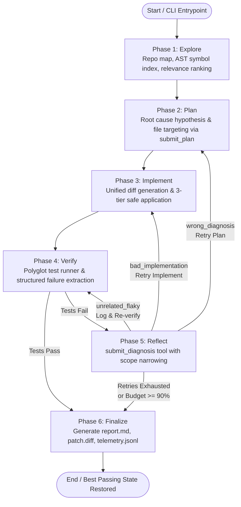

# Autonomous Coding-Agent Harness

An autonomous, multi-phase coding agent harness built to diagnose issues, plan modifications, generate unified diffs, run verification test suites, reflect on failures with adaptive scope narrowing, and produce finalized audit reports.

---

## Architecture

The harness is structured as an adaptive state machine driven by [harness/orchestrator.py](file:///Users/nikhilsingh/Ai_Harness_Hackathon/harness/orchestrator.py). Execution flows through six discrete phases:



### The 6 Phases

1. **Phase 1: Explore ([harness/explore.py](file:///Users/nikhilsingh/Ai_Harness_Hackathon/harness/explore.py))**
   - Scans the repository to construct a lightweight file tree, detects languages and frameworks, and builds an AST symbol index (classes, functions, methods).
   - Combines stack trace extraction, keyword heuristics, symbol matches, and ripgrep code search to rank relevant files before consuming model tokens.
2. **Phase 2: Plan ([harness/plan.py](file:///Users/nikhilsingh/Ai_Harness_Hackathon/harness/plan.py))**
   - Analyzes the issue description and top ranked files.
   - Invokes the LLM using the structured `submit_plan` tool to emit a root cause hypothesis, list of files to modify, step-by-step approach, risks, and test strategy.
   - Validates that target files exist in the repository; if non-existent paths are returned, it re-prompts with valid suggestions.
3. **Phase 3: Implement ([harness/implement.py](file:///Users/nikhilsingh/Ai_Harness_Hackathon/harness/implement.py))**
   - Feeds annotated existing code and the plan into the model to generate unified diffs.
   - Creates git checkpoints (`checkpoint_pre_iter_N`) prior to touching files.
   - Applies diffs via a 3-tier application pipeline (`git apply --check` $\rightarrow$ custom patch hunk parser $\rightarrow$ fuzzy replacement).
4. **Phase 4: Verify ([harness/verify.py](file:///Users/nikhilsingh/Ai_Harness_Hackathon/harness/verify.py))**
   - Automatically detects the test framework (pytest, unittest, jest, vitest, mocha, go test, cargo test) or runs an explicit user-provided `--test-cmd`.
   - Runs subprocesses with strict timeout isolation (default: 120s) and parses test runner outputs into structured counts (`passed`, `failed`, `errors`), failure tracebacks, and assertion summaries.
5. **Phase 5: Reflect ([harness/reflect.py](file:///Users/nikhilsingh/Ai_Harness_Hackathon/harness/reflect.py))**
   - Triggered when verification fails.
   - Diagnoses failures using `submit_diagnosis` into one of three classifications:
     - `bad_implementation`: Plan was correct, but the patch was flawed $\rightarrow$ re-triggers Implement.
     - `wrong_diagnosis`: Root cause was incorrect $\rightarrow$ re-triggers Plan.
     - `unrelated_flaky`: Failure is external or non-deterministic $\rightarrow$ ignores or re-verifies.
   - Enforces progressive scope narrowing across cycles to prevent runaway rewrites.
6. **Phase 6: Finalize ([harness/telemetry.py](file:///Users/nikhilsingh/Ai_Harness_Hackathon/harness/telemetry.py))**
   - Evaluates overall success. If later iterations regressed, restores the best passing checkpoint observed (`BestState`).
   - Produces three persistent artifacts in the repository directory: `report.md`, `patch.diff`, and `telemetry.jsonl`.

---

## Design Decisions

- **Git-Backed Isolation & Rollback**:
  - The harness creates an initial checkpoint tag (`checkpoint_pre_run_initial`) before performing any modifications, followed by per-iteration tags (`checkpoint_pre_iter_N`, `checkpoint_post_iter_N`).
  - If a patch causes severe regressions or syntax failures, the working tree is cleanly rolled back to the prior checkpoint without corrupting the repo.
- **Best-State Preservation (`BestState`)**:
  - Rather than reporting failure based only on the final cycle, the orchestrator tracks the highest-scoring state observed across all attempts (most passed tests, fewest failures).
  - If retries fail or token budget runs out, the repository rolls back to the best verified state before finalizing.
- **Surgical Reflection Scope Narrowing**:
  - To prevent models from destabilizing existing functionality through broad rewrites during retries, prompt constraints tighten per reflection cycle:
    - *Cycle 1*: General failure diagnosis and targeted fixes.
    - *Cycle 2*: Narrow focus on edge cases and validation logic within already touched files.
    - *Cycle 3*: Strict surgical scope (prohibits broad refactoring, limits targets to minimum files).
    - *Cycle 4*: Ultra-surgical micro-fixes (1–2 line bug fix; zero collateral modification allowed).
- **Multi-Provider LLM Abstraction with OpenAI-Compatible Flexibility**:
  - Exposes a unified `call_model` interface ([harness/model.py](file:///Users/nikhilsingh/Ai_Harness_Hackathon/harness/model.py)) supporting Anthropic, Google Gemini, and OpenAI.
  - Supports custom `base_url` routing, allowing the OpenAI backend to communicate directly with NVIDIA's API Catalog (e.g., Nemotron models at `https://integrate.api.nvidia.com/v1`), vLLM, or Azure endpoints.
- **Resilient Fallback Parsing**:
  - All phases use native structured tool calling (`tools=...`).
  - If an LLM returns markdown-fenced JSON (e.g. ```` ```json {...} ``` ````) or plain text JSON instead of calling the tool function, regex and heuristic parsers automatically extract the structured payload so the harness never crashes.

---

## Tool Interface

The harness leverages native tool-calling schemas that are automatically translated to each provider's dialect (Anthropic tool specs $\leftrightarrow$ OpenAI function specs).

### 1. `submit_plan` (Plan Phase)

Emitted by the LLM in Phase 2 to submit the proposed course of action:

```json
{
  "name": "submit_plan",
  "description": "Submit structured implementation plan for the issue",
  "parameters": {
    "type": "object",
    "properties": {
      "root_cause_hypothesis": {
        "type": "string",
        "description": "Direct explanation of why the bug occurs or what needs to be added"
      },
      "files_to_modify": {
        "type": "array",
        "items": { "type": "string" },
        "description": "Relative paths of existing files that will be modified"
      },
      "approach": {
        "type": "string",
        "description": "Step-by-step description of the planned code modifications"
      },
      "risks": {
        "type": "array",
        "items": { "type": "string" },
        "description": "Potential side effects, edge cases, or regression risks"
      },
      "test_strategy": {
        "type": "string",
        "description": "How the changes will be validated against the test suite"
      }
    },
    "required": ["root_cause_hypothesis", "files_to_modify", "approach", "risks", "test_strategy"]
  }
}
```

### 2. `submit_diagnosis` (Reflect Phase)

Emitted by the LLM in Phase 5 when tests fail:

```json
{
  "name": "submit_diagnosis",
  "description": "Submit failure diagnosis and classification with an updated implementation plan",
  "parameters": {
    "type": "object",
    "properties": {
      "classification": {
        "type": "string",
        "enum": ["wrong_diagnosis", "bad_implementation", "unrelated_flaky"],
        "description": "Diagnosis classification category"
      },
      "reasoning": {
        "type": "string",
        "description": "Detailed explanation of why the tests failed"
      },
      "updated_plan": {
        "type": "object",
        "properties": {
          "root_cause_hypothesis": { "type": "string" },
          "files_to_modify": { "type": "array", "items": { "type": "string" } },
          "approach": { "type": "string" },
          "risks": { "type": "array", "items": { "type": "string" } },
          "test_strategy": { "type": "string" }
        },
        "required": ["approach"]
      }
    },
    "required": ["classification", "reasoning", "updated_plan"]
  }
}
```

---

## Verification & Stopping Criteria

All numbers and limits are configured in [harness/orchestrator.py](file:///Users/nikhilsingh/Ai_Harness_Hackathon/harness/orchestrator.py) and [harness/reflect.py](file:///Users/nikhilsingh/Ai_Harness_Hackathon/harness/reflect.py):

| Criterion | Configured Value | Description |
| :--- | :--- | :--- |
| **Base Token Budget** | `50,000` tokens | Starting token allocation for standard repositories (`DEFAULT_BASE_TOKEN_BUDGET`). |
| **Max Scale Multiplier** | `4.0x` | Maximum scaling factor for large repositories. |
| **Budget Scale Formula** | $\min(4.0, 1.0 + 0.3 \cdot \text{file\_scale} + 0.7 \cdot \text{loc\_scale})$ | Scales budget when repo exceeds 10 files or 1,000 lines of code. |
| **Exhaustion Threshold** | `90%` (`0.90`) | If cumulative token consumption reaches 90% of budget, stops retrying and finalizes immediately. |
| **Phase Budget: Explore** | `15%` | Allocated token share for repository exploration and ranking. |
| **Phase Budget: Plan** | `10%` | Allocated token share for plan generation. |
| **Phase Budget: Implement** | `35%` | Allocated token share for unified diff generation. |
| **Phase Budget: Verify** | `15%` | Allocated token share for test evaluation and parsing. |
| **Phase Budget: Reflect** | `25%` | Allocated token share for failure diagnosis. |
| **Max Retry Iterations** | `3` attempts | Default maximum Implement $\rightarrow$ Verify $\rightarrow$ Reflect loop attempts (CLI `--max-retries`, range 0–10). |
| **Max Reflect Cycles** | `4` cycles | Upper bound on consecutive reflection diagnoses (`DEFAULT_MAX_REFLECT_CYCLES`). |
| **Test Execution Timeout** | `120` seconds | Subprocess wall-clock timeout per test execution before termination. |
| **Success Stopping Rule** | `all_passed == True` | `failed == 0`, `errors == 0`, and test runner exit code is `0`. |

---

## Known Limitations & Deviations

### Deviations Made During Implementation

1. **OpenAI & NVIDIA Nemotron Backend**:
   - *Original Plan*: Relied primarily on Anthropic and Google Gemini.
   - *Deviation*: Due to Google API deprecations and strict rate limits, we implemented a full OpenAI-compatible client in `_call_openai()`. Added configurable `base_url` support to route requests to NVIDIA's Nemotron endpoint (`https://integrate.api.nvidia.com/v1`).
2. **CLI Config Propagation**:
   - Fixed an issue in [main.py](file:///Users/nikhilsingh/Ai_Harness_Hackathon/main.py) where custom `base_url` and `api_key` loaded from `config.yaml` were omitted when instantiating the CLI `ModelConfig`.
3. **Pristine Pre-Run Checkpoint**:
   - Added `checkpoint_pre_run_initial` prior to executing any phase so `finalize_report()` can extract a clean standalone `patch.diff` against the untouched repository state.
4. **Pytest Collection Safeguard**:
   - Dataclasses `TestFailure` and `TestResult` in `harness/verify.py` triggered pytest discovery warnings; resolved by setting `__test__ = False`.
5. **Fallback JSON & Markdown Extraction**:
   - Because open-source or proxy models occasionally return tool outputs as markdown-fenced text rather than native tool call objects, regex fallback extractors were implemented in `plan.py` and `reflect.py`.

### Known Limitations

- **Single Repository Scope**: The harness operates within a single repository root and does not traverse external multi-repo dependencies or submodule checkouts.
- **Polyglot Runner Auto-Detection**: Supported out-of-the-box for Python (`pytest`, `unittest`), JavaScript/TypeScript (`jest`, `vitest`, `mocha`), Go (`go test`), and Rust (`cargo test`). Other runners require an explicit `--test-cmd` argument.
- **Binary & Asset Changes**: Changes are strictly applied through unified diffs; binary files (images, compiled archives) cannot be edited or created.

---

## How to Run

### 1. Prerequisites & Installation

Requires Python 3.10+:

```bash
# Create and activate virtual environment
python3 -m venv .venv
source .venv/bin/activate

# Install dependencies
pip install -r requirements.txt
```

### 2. Configure Model & Credentials

Create a `.env` file in the project root:

```env
# For NVIDIA Nemotron
NVIDIA_API_KEY="nvapi-your-key-here"

# For OpenAI
OPENAI_API_KEY="sk-proj-your-key-here"

# For Anthropic
ANTHROPIC_API_KEY="sk-ant-your-key-here"
```

Configure [config.yaml](file:///Users/nikhilsingh/Ai_Harness_Hackathon/config.yaml):

```yaml
# Supported values: "openai" | "anthropic" | "google"
model_provider: "openai"

# Model identifier
model_name: "nvidia/nemotron-3-ultra-550b-a55b"

# API key environment variable name
api_key_env_var: "NVIDIA_API_KEY"

# Optional base_url for NVIDIA Nemotron or local proxies
base_url: "https://integrate.api.nvidia.com/v1"

temperature: 0.0
max_tokens: 4096
```

### 3. Run the Test Suite

Verify that all unit and integration tests pass:

```bash
./.venv/bin/pytest tests/
```

### 4. Run the Harness on a Repository

Execute `main.py` specifying the task and target repository:

```bash
./.venv/bin/python main.py \
  "Fix format_greeting in text_utils.py so it includes a comma after Hello (e.g. 'Hello, Alice!')" \
  --repo test_fixtures/sample_repo \
  --log test_fixtures/sample_repo/telemetry.jsonl
```

#### CLI Options

- `--repo, -r`: Path to target repository root (default: `.`).
- `--model, -m`: Override model identifier.
- `--provider, -p`: Override model provider (`openai`, `anthropic`, `google`).
- `--max-retries`: Maximum Implement $\rightarrow$ Verify retry attempts (default: `3`).
- `--test-cmd`: Explicit test command override (e.g. `pytest tests/test_core.py`).
- `--linter-cmd`: Explicit linter command override (e.g. `ruff check .`).
- `--log`: Output path for the JSONL telemetry log (default: `harness_run.jsonl`).

### 5. Inspect Generated Artifacts

Upon completion, three files are written to the target repository:

1. **`report.md`**: Human-readable executive summary covering root cause found, changes made, test table before and after, unresolved items, and total tokens used.
2. **`patch.diff`**: Clean unified diff representing all applied modifications.
3. **`telemetry.jsonl`**: Machine-readable chronological trace of phase transitions, latency, token consumption, and subprocess results.
